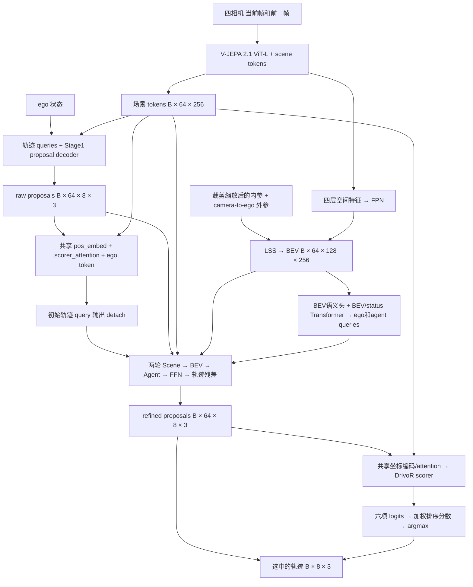

# RepDrive / DriveJEPA3 网络结构与 Agent 交接文档

维护日期：2026-09-06。核对基线：GitHub `main` 源码提交 `4465ec6`，以及本地 `train_jepa3_stage2.sh`、`drivejepa3.yaml`。本文记录已实现的 V8 路径；模型、配置或训练覆盖项改变时，应在同一次变更中更新本文。源码与实际运行的 Hydra 配置优先于文档，日期和实验目录名不能单独证明模型版本。

## 1. 先读这里

当前入口是 `DriveJEPA3Agent → DriveJEPA3Model`，默认选择 `DriveJEPA3PlanningAwareDecoder`。网络使用四相机两帧图像，生成 64 条候选轨迹，再通过 Scene → BEV → Agent 交互细化整条轨迹，最后用原 DrivoR scorer 对细化结果重新评分并选一条输出。

`DriveJEPA3Decoder` 是保留的旧版逐 waypoint GRU 路径；当前模型通过其子类复用 BEV/agent 模块，替换 proposal refiner。不要把旧类、文件中的 `post_scorer_decoder` 名称或旧 README 的描述当作当前执行顺序。V8 表示当前训练/评分设置；解码器注释中的 V2 表示整轨迹细化结构，两者不是同一个版本编号。

本地源码根目录：`/home/dataset-assist-0/yinhongbo/code/robotics`。GitHub 发布仓库只包含模型相关代码和 V-JEPA 源码依赖；完整训练还依赖本地 NAVSIM/nuPlan 框架、数据、权重和 metric cache。

## 2. 网络数据流



### 输入与中间张量

以下是当前默认配置的形状；B 是 batch，Nh 是 ego 历史帧数。空间形状由配置与源码推导，未在本次文档维护中运行完整权重前向。

| 字段/节点 | 形状 | 语义 |
| --- | --- | --- |
| `camera_feature_1` / `camera_feature_2` | `[B,4,3,256,512]` | 当前帧 / 前一帧；相机固定顺序 front、left、right、back，即 f0/l0/r0/b0 |
| `intrinsics` / `extrinsics` | `[B,4,3,3]` / `[B,4,4,4]` | 内参随裁剪缩放修正；外参由 sensor2lidar rotation/translation 构造 |
| `future_egomotion` | `[B,1,6]` | 当前 feature builder 输出全零 |
| `ego_status` | `[B,Nh,11]` | pose(3)、velocity(2)、acceleration(2)、command(4)；当前模型取最后一帧 |
| `scene_embeds` 参数 | `[1,4,16,1024]` | 每相机独立的 scene token bank |
| 编码器 scene 输出 | `[B*4,16,256]` | 合并相机后为 `[B,64,256]` |
| 编码器多层空间输出 | 4 个 `[B*4,256,16,32]` | 取 ViT 层 `[5,11,17,23]`，通道映射到 256 |
| FPN 输出 | `[B,4,256,16,32]` | 送入 LSS |
| LSS BEV | `[B,64,128,256]` | X: `[0,32)`、Y: `[-32,32)`，分辨率 0.25m |
| proposal / refiner query | `[B,64,256]` | 一条候选对应一个 token |
| `raw_proposals` / `refined_proposals` | `[B,64,8,3]` | 每点 `(x,y,heading)`，4秒时域、0.5秒间隔 |
| BEV decoder key/value | `[B,65,256]` | BEV 池化至 8×8，再加一个 8维 status 编码 token |
| ego query / agent queries | `[B,1,256]` / `[B,30,256]` | 三层 Transformer decoder 输出 |
| `agent_states` / `agent_labels` | `[B,30,5]` / `[B,30]` | agent 状态与 objectness logits |
| `bev_semantic_map` | `[B,7,128,256]` | BEV 分类 logits |
| `pdm_score` / `trajectory` | `[B,64]` / `[B,8,3]` | 候选排序分数 / 最终轨迹 |

图像先裁剪上下各 28 行，resize 到 `(W,H)=(512,256)`，ToTensor 后在 model 中做 ImageNet normalization。不能只改 resize 而不改内参。两帧属于 V-JEPA 的时序输入，不是把相机数翻倍。当前 `lidar_pc=[]`，LiDAR 配置只是预留项。

## 3. 各子网络的实际职责

**Stage1 proposal generator。** 当前 ego 的 11维状态映射到 256维，与 64个可学习 query 相加。初始 trajectory head 加 4轮 decoder/head，总计产生 5个 `raw_proposal_list` 元素；最后一组作为 `raw_proposals`。这里的 `ref_num=4` 与后续的 `decoder_ref_num=2` 是不同层级。

**LSS/BEV 与 agent 支路。** 空间特征通过 FPN 和显式几何投影构建 BEV；深度范围 `[2,50)`、步长 1m，Z 为单层 `[-10,10)`。BEV 同时送入语义头、BEV/status Transformer 和轨迹采样交互。Transformer 用 1个 ego query 和 30个 agent query 读取池化后的 BEV 与 status；其 agent 输出也作为 refiner 的交互对象。不要把配置中的 `bev_token_hw=[8,16]` 当成此 decoder 的 pooling 尺寸，此处使用 `bev_downscale_size=8`。

**初始轨迹 query。** `_encode_trajectory_query` 将 `raw_proposals.flatten(-2).detach()` 经 `pos_embed`、`scorer_attention(scene_features)`，再加 ego token。该结果在进入 refiner 前 detach，但编码模块本身在 V8 是可训练的，而且与最终 scorer 路径共享。

**两轮整轨迹细化。** 每轮构建 `initial_query + proposal_pos_embed(anchors) + ego_query`，依次执行：场景 token cross-attention；沿当前轨迹所有 waypoint 对 BEV 做双线性采样并注意力聚合；基于每个 agent 到轨迹最近 waypoint 的相对 XY、欧氏距离和相对 heading 做交互，并用 agent sigmoid confidence 缩放 memory；最后 FFN 和 residual head 一次输出全部 8点的修正。heading 修正用 `tanh * pi` 限制，再乘 residual scale 与 anchors 相加。

当前第二轮读取第一轮轨迹的 detach 结果，但 query 重置回同一个 initial query，不传递上一轮 query state。两轮使用独立 refinement layer。`decoder_residual_init_std=0` 使最终线性层权重和 bias 为零：新建 refiner 时初始细化轨迹等于原轨迹；加载训练过的 checkpoint 后不再保证相等。

**最终 scorer。** 用 refined 坐标再次调用共享 `_encode_trajectory_query`，这次不 detach 输出，再输入 `Scorer`。坐标进入 pos_embed 前仍 detach，因此不能宣称评分损失经该坐标编码分支反传到 refiner。V8 `InteractionResidualScorer` 保留参数用于 V7 checkpoint 兼容，但 forward 调用已注释，输出 `interaction_score_residual=None`；只修改 scale 无法启用该路径。

排序公式中令 p 为六项 logits 的 sigmoid：

```text
score = noc*log(p_noc) + dac*log(p_dac) + ddc*log(p_ddc)
      + log(ttc*p_ttc + ep*p_ep + comfort*p_comfort)
trajectory = refined_proposals[argmax(score)]
```

默认权重 `(noc,dac,ddc,ttc,ep,comfort)=(1,1,0,5,5,2)`；评估脚本支持环境变量覆盖。这里是网络候选排序分数，不是外部仿真得到的真实 NAVSIM PDM 指标。

## 4. V8 训练和梯度边界

依据 `DriveJEPA3Model.__init__` 的 `_stage1_modules` 列表和 `train()`：

| 模块 | 当前 V8 状态 |
| --- | --- |
| V-JEPA、LoRA、scene_embeds | 冻结；backbone eval，编码使用 no_grad |
| image_fpn、lss_bev_projector | 冻结且 eval |
| hist_encoding、init_feature、trajectory_decoder、traj_head | 冻结且 eval；proposal 生成禁用梯度 |
| post_scorer_decoder 的语义头、BEV下采样、位置/status embedding、ego/agent queries、tf_decoder、agent_head | 冻结且 eval |
| post_scorer_decoder.proposal_refiner | 训练；含位置编码和两轮交互/残差头 |
| pos_embed、scorer_attention、scorer | 训练；V8 从冻结列表中显式重新开启 |
| interaction_residual_scorer | 参数仍可能 requires_grad 并进入优化器，但未执行，不参与当前损失梯度 |

决定这一行为的配置是 `freeze_stage1=false`、`freeze_stage1_except_scorer=true`、`freeze_image_backbone=true`、`freeze_proposal_generator=true`、`detach_initial_query=true`。不能把“训练 Stage2”泛化成训练整个 FPN/LSS/BEV 分支。

AMP 关键约束：首次共享 scorer 编码调用必须保留正常 grad context，仅对输出 detach。若首次调用包在 no_grad 中，autocast 可能缓存 detached 的低精度权重并复用于最终 scorer 调用，导致 scorer 梯度断开。`DriveJEPA3ScorerGradientAudit` 在 backward 后检查 pos_embed/scorer_attention/scorer 的可训练参数是否存在梯度；已有对应回归测试。

损失对两轮 refined proposals 做轨迹监督：`L_traj = L_last + 0.1*mean(L_earlier)`；每轮使用 best-of-64 的平均 waypoint L1，存在 `trajectory_long` 时再加对应项。raw_proposal_list 不进入这条细化损失。最终 loss 还组合 scorer、可选预测、agent 分类/box 和 BEV semantic loss，实际系数及分支以 loss YAML/代码为准。冻结的辅助头仍可产生并记录 loss，但不能据此认定它们正在更新。训练目标的外部 PDM 计算先 detach 候选。

训练脚本覆盖 YAML 后：4 GPU × 每卡64 = global batch256；base_lr=2e-4，按 `sqrt(global_batch/base_batch)` 缩放（base_batch64）得到初始目标 LR 4e-4；scorer multiplier=1、weight_decay=0，新增模块使用 AdamW 默认 weight_decay。前10% steps 线性 warmup 后 cosine；10 epochs、gradient_clip_val=1、每 rank16个评分 worker。脚本还设置 `long_trajectory_additional_poses=2`；它是额外 target 配置，不会把网络 `num_poses=8` 改成10。模型更新后应同时核对脚本覆盖项，不能只看 YAML。

## 5. 输出、权重与代码入口

`raw_proposal_list` 是 Stage1 的5组预测；`proposal_list` 和 `poses_reg_list` 是2轮细化结果；`proposals` 等于 `refined_proposals`。`refiner_query_list` 保存每轮 query。loss 使用 refined 候选，最终选择也从 refined 候选中取，不能意外改回 raw。

checkpoint loader 将 `agent._drivor_model` 映射到 `_drivor_model`，将旧 `bev_agent_decoder.` 映射到 `post_scorer_decoder.`。虽然调用 strict=False，但随后检查 missing/unexpected keys，仅允许 trajectory_query、proposal_refiner、interaction_residual_scorer 三类前缀缺失；其它缺失或多余项报错。shape mismatch 不会因 strict=False 自动修复。四相机 scene_embeds 必须匹配 `[1,4,16,1024]`。

| 阅读顺序 | 文件/关键符号 |
| --- | --- |
| 1 | [drivejepa3.yaml](../navsim/planning/script/config/common/agent/drivejepa3.yaml)、[训练覆盖项](../train_jepa3_stage2.sh) |
| 2 | [drivejepa3_model.py](../navsim/agents/drivoR/drivejepa3_model.py)：decoder_cls、冻结列表、train、_encode_trajectory_query、forward |
| 3 | [drivejepa3_decoder.py](../navsim/agents/drivoR/drivejepa3_decoder.py)：PlanningAwareDecoder/ProposalRefiner/RefinementLayer |
| 4 | [drivejepa2_features.py](../navsim/agents/drivoR/drivejepa2_features.py)、[vjepa2_1_lora.py](../navsim/agents/drivoR/layers/image_encoder/vjepa2_1_lora.py)、[lss_bev.py](../navsim/agents/drivoR/drivejepa2_bevformer/lss_bev.py) |
| 5 | [drivejepa3_agent.py](../navsim/agents/drivoR/drivejepa3_agent.py)：initialize、优化器、梯度审计；[drivejepa3_loss.py](../navsim/agents/drivoR/layers/losses/drivejepa3_loss.py) |
| 6 | [评估脚本](../eval_drivejepa3_full_navtest.sh)、[权重审计脚本](../audit_drivejepa3_checkpoint.py) |

## 6. 交接与维护约定

后续 agent 修改网络时，同步更新：本页维护日期/源码基线、数据流、输入输出形状、梯度边界、checkpoint 兼容性和验证结果。区分默认配置、脚本覆盖与具体 checkpoint 配置；没有运行证据时不要把配置推导写成实测。其它历史结构草稿可供参考，当前 V8 路径以本文及源码为准。

相关验证命令（在完整本地项目的 drivoR 环境）：

```bash
python -m pytest -q tests/test_drivejepa3_autoregressive.py tests/test_drivejepa3_planning_aware.py
```

上次源码发布验证：6 passed。覆盖旧/新 decoder 的局部行为、几何、残差 scorer 模块和共享编码 AMP 梯度；使用小配置，不等于完整 V8 训练或 NAVSIM 指标复现。此次仅维护文档，没有重新运行完整训练/评估。

可直接给另一个 agent 的任务前置说明：

> 先读 md/NETWORK_ARCHITECTURE.md，再读 drivejepa3_model.py 的 decoder_cls、冻结列表和 forward。当前是四相机 V-JEPA 2.1 proposal generator + 两轮整轨迹 Scene/BEV/Agent refiner + 原 scorer 重评分。V8 冻结旧特征路径，训练新 refiner 和共享 scorer。保留 initial-query 输出 detach 的 AMP 约束。修改前核对 YAML、训练覆盖和 checkpoint keys，修改后同步本文并跑相关回归测试。
